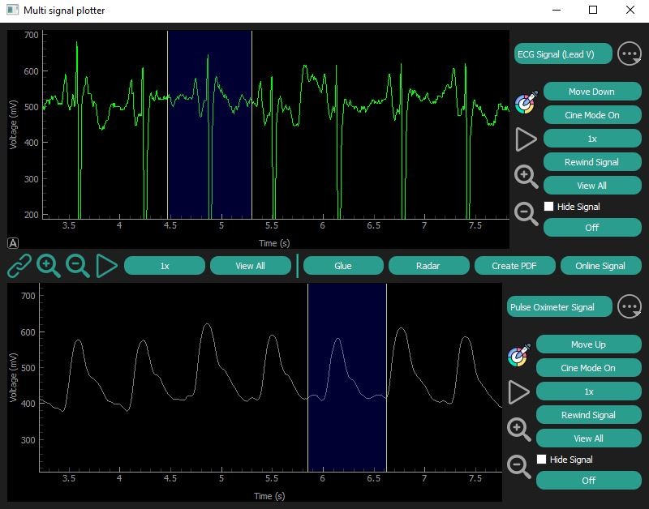

# Real-Time Signal Viewer


## Overview
This application is designed to display and manipulate multiple signals simultaneously, with a range of features aimed at controlling the display and analysis of the signals. It supports two channels, where each channel can display multiple signals, and provides several controls to manage their display, synchronization, and data analysis.


## Features
1. **Two Channels:** The app supports two channels, each capable of displaying multiple signals simultaneously.
2. **Signal Controls:**
   - Change signal color.
   - Hide and unhide signals.
   - Control the speed of signal display.
   - Pause, start, and rewind signals.
   - Zoom in and out on the signals.
   - Link the signals of the two channels to run in sync.
3. **Signal Gluing:** The app allows you to glue parts of a signal from channel one and parts of a signal from channel two to create a new combined signal.
   
   <p float="left">
      
      
  </p>
   
4. **Signal Report Generation:** You can generate a PDF report displaying the meean, duration, minimum, maximum, and standard deviation (std) of the signal.

   

5. **Non-Rectangular Signals:** The application supports non-rectangular signals, such as radar signals, in addition to standard signal types.

    

7. **Real-Time Online Signals:** The app can display real-time signals from any API. For example, we have implemented a real-time Bitcoin price display fetched from an online API.


## Installation

1. Clone the repository:
   ```bash
   git clone https://github.com/Ahmed-Hajhamed/Real-Time-Signal-Viewer.git
   ```
2. Install required dependencies:
   ```bash
    pip install -r requirements.txt
   ```
3. Usage:
Run Main.py class:
   ```bash
    python app.py
   ```

## Usage
Once the application is launched, you can:
- Select signals to display on each channel.
- Use the controls to manipulate the signals (pause, zoom, change color, etc.).
- Sync the signals between the two channels.
- Generate and export a report showing signal statistics.
- Fetch and display online signals in real time.

## Contributing
Contributions are welcome! If you have suggestions for improvements or new features, feel free to open an issue or submit a pull request.

## Contact
For questions or issues, please reach out via email: ahmed.hajhamed03@eng-st.cu.edu.eg
